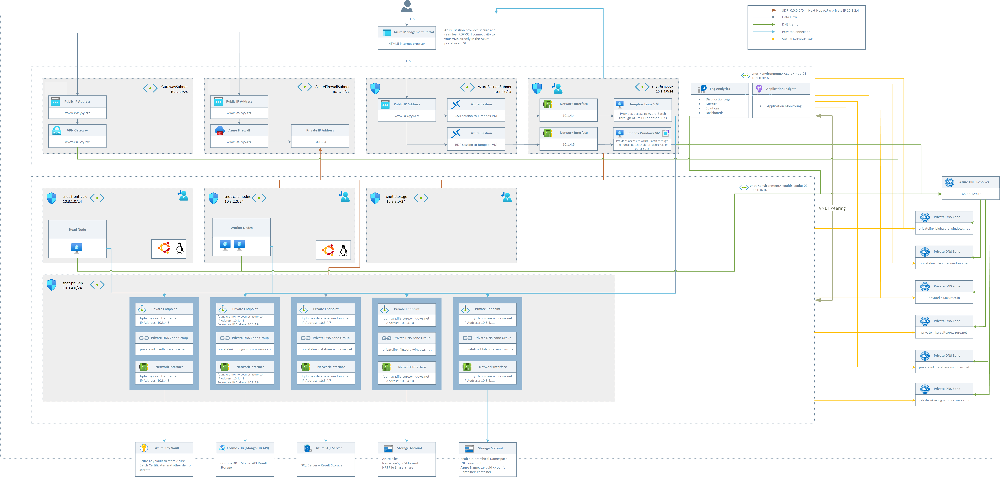

# Azure-NxOneView
Simple Demo to demonstrate how Nx One View could be deployed to Azure

## High-Level Overview

# Status
Work in progress. Needs a bit of cleanup, since two demos (Azure Batch & Nx One View are combined)
